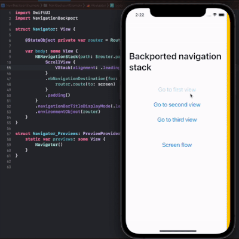

# Navigation backport example

    
    

Test project for SwiftUI new navigation API (availabled starting with iOS 16) backported in older SwiftUI versions. 

This project uses [NavigationBackport](https://github.com/johnpatrickmorgan/NavigationBackport) package as a dependency. 

Full demo video is [here](https://t.me/swiftui_dev/213).

  

  
  

